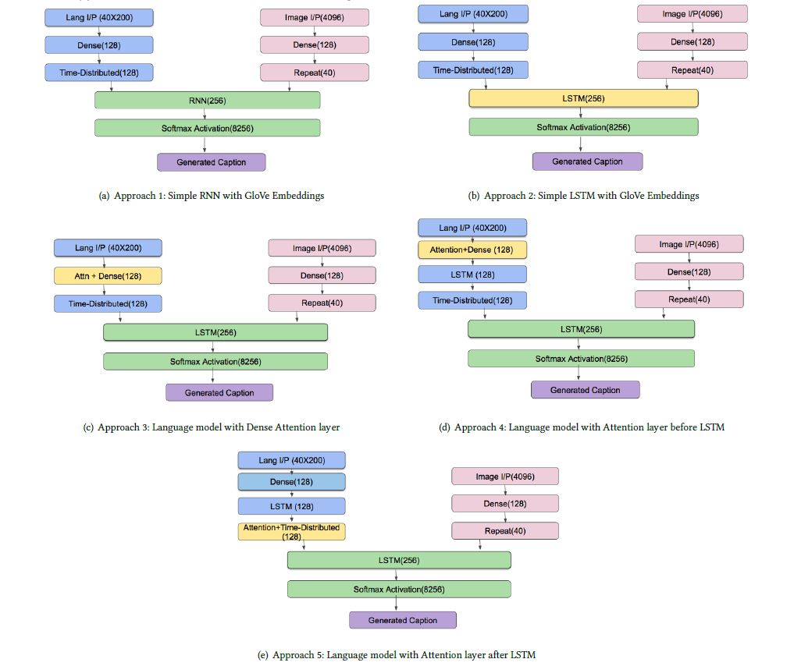

# Image captioning with Attention

## About
This project was done as part of Statistical and machine learning course at Carnegie Mellon University. This repository describes an attention model that builds over basic image-text joint probability modelling approach for image captioning.

## Dataset

* Images - Flickr8k ([Images](http://nlp.cs.illinois.edu/HockenmaierGroup/Framing_Image_Description/Flickr8k_Dataset.zip) and [Captions](http://nlp.cs.illinois.edu/HockenmaierGroup/Framing_Image_Description/Flickr8k_text.zip))
* Caption embeddings - [GloVe](https://nlp.stanford.edu/projects/glove/) embeddings

## Model Archtechture

    

## Model Input

### Image 
Pre-trained 4096d VGGNET features. Run `vggnet.py` to obtain the image embeddings.

### Language 
GloVe embeddings 160d.  Run `caption/prepare_data.py` to obtain the word embeddings.

## Model Output

Next word in the caption

## Training

To train the models, run one of the train files below:
* Approach 1 : `train_model.py`
* Approach 2 : `train_model_basic.py`
* Approach 3 : `train_advanced_model.py`
* Approach 4 : `train_advanced_model_before.py`
* Approach 5 : `train_advanced_model_after.py`

## Testing
Run `train_model.py` after changing the weights file name.

## Results

    

    

## References

[1] [Show and Tell: A Neural Image Caption Generator](https://arxiv.org/pdf/1411.4555.pdf)

[2]	[Caption generator](https://github.com/anuragmishracse/caption_generator) repository

[3] VGGNet architecture obtained from [Very Deep Convolutional Networks for Large-Scale Image Recognition](https://arxiv.org/abs/1409.1556)
